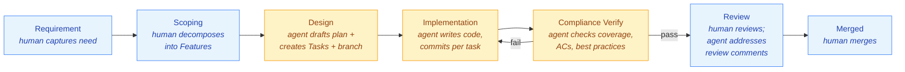

# gh-agentic

[](https://github.com/eddiecarpenter/gh-agentic/actions/workflows/build-and-test.yml)
[](https://github.com/eddiecarpenter/gh-agentic/releases/latest)
[](https://sonarcloud.io/summary/new_code?id=eddiecarpenter_gh-agentic)
[](go.mod)
[](LICENSE)

> A GitHub CLI and **agentic software delivery framework**. Humans do the thinking; AI agents do the work.

> 📘 **For installation and a hands-on walkthrough → [GETTING_STARTED.md](GETTING_STARTED.md)**

---

## What this is

`gh-agentic` is two things in one repository:

1. **A GitHub CLI extension** (`gh agentic ...`) that bootstraps and manages the environment a repo needs to run agentic software delivery: creating projects, configuring secrets and variables, mounting the framework, verifying the setup, and managing Claude Code credentials.
2. **The AI-Native Delivery Framework** itself: a library of skills, recipes, standards and reusable workflows that any repo can consume as a tracked git submodule at `.agents/`. The framework defines *how* requirements become features become tasks become commits become a pull request.

You run `gh agentic init` once in your repo, inherit the entire pipeline, and from then on move work through phases by applying GitHub labels to issues. Every artefact (Requirement, Feature, Task, Design Plan, PR) is durable on GitHub. Every phase is observable on the GitHub Project board. Every transition is auditable in label history.

---

## How it works

### The pipeline



Phase transitions are driven by GitHub labels on the issue, but humans don't apply those labels by hand. The framework provides primitive skills (`trigger-design`, `trigger-implementation`) that pick the right label based on the Feature's flags. The human gates **entry** into the agent pipeline (invoking `trigger-design` for a scoped Feature) and **exit** (reviewing the PR). Within the agent pipeline, **design hands off to implementation, which hands off to compliance verification, autonomously**: once headless design completes, `trigger-implementation` transitions the Feature to `in-development` without waiting for human input; the dev-session fires, and on completion the compliance-verify skill runs an AI-driven code review against the diff, evaluates every acceptance criterion, and — only on a clean pass — opens the PR and transitions the Feature to `in-review`. On failure, structured feedback is posted and `in-development` is re-applied, triggering a new dev-session. Only on a clean compliance pass does the Feature reach `in-review` for human inspection. Every other handoff (Requirement → Scoping, Scoping → Design, Review → Merged) is gated by a human action.

`trigger-design` reads the Feature's labels to pick the right path: a Feature flagged `needs-interactive-design` (set during scoping for UX/UI work, novel architecture, or anything where a wrong design is expensive to undo) gets `interactive-design`; everything else gets `in-design` and runs headlessly. For Features that took the interactive path, the human chooses at end-of-design between *trigger now*, *park at `designed`*, or *cancel*. A parked Feature is later un-parked by invoking `trigger-implementation`, the same primitive the headless design auto-fires, just human-driven this time.

### What triggers what

| Label transition | Workflow that fires | What the agent does |
|---|---|---|
| `backlog` → `scoping` | none (interactive) | A human runs `/requirement-scoping` in their workbench; the agent walks nine artefacts and produces Feature issues |
| `backlog` → `in-design` (via `trigger-design`) | `agentic-pipeline.yml` (Stage 3) | Reads the Feature, drafts a Design Plan rationale, creates ordered Task sub-issues, creates the feature branch, then auto-applies `in-development` so Stage 4 fires without human input |
| `backlog` → `interactive-design` (via `trigger-design` when `needs-interactive-design` is set) | none (interactive) | A human runs `/feature-design <N>` for Features that need foreground attention (UX, novel architecture); at end-of-design the human chooses whether to trigger implementation, park at `designed`, or cancel |
| `in-design` → `in-development` (autonomous) | `agentic-pipeline.yml` (Stage 4) | Walks each Task in order, writes code, runs tests, commits per task, pushes |
| `designed` → `in-development` (via `trigger-implementation`) | `agentic-pipeline.yml` (Stage 4) | Same as above; this is the path for Features that were parked at `designed` after interactive design |
| `in-development` → `in-verification` | `agentic-pipeline.yml` (Stage 5) | Runs the compliance-verify skill: AI code review + native static analysis against the diff; evaluates every AC; loops back to `in-development` with a structured feedback comment on any failure |
| `in-verification` → `compliance-verified` | `agentic-pipeline.yml` (Stage 5) | All checks pass; compliance-verify posts a structured PR body and applies `compliance-verified`; the workflow opens the PR and transitions to `in-review` |
| PR review submitted (changes requested) | `agentic-pipeline.yml` (Stage 6) | Reads the review, implements requested changes, commits, pushes |
| PR merged | `agentic-pipeline.yml` (Stage 7) | Closes the Feature; transitions parent Requirement to `done` if all child Features are complete |

### Stage 5 — Compliance Verify

Compliance Verify is the quality gate that sits between implementation and the human PR reviewer. It runs headlessly on the feature branch after the dev-session completes and before any PR is opened. Nothing reaches `in-review` that has not passed this stage.

**Two independent checks run on every feature:**

**1. Static analysis.** Native tooling (stack-dependent — `go vet`, `golangci-lint`, `govulncheck` for Go; `tsc`, `eslint`, `npm audit` for TypeScript/React; SpotBugs, Checkstyle, OWASP Dependency Check for Java) is run where available on the runner. An **AI-driven code review** always runs regardless of tooling — it examines the diff and every changed file against a 10-category checklist:

| Category | Severity |
|---|---|
| Hardcoded secrets — API keys, tokens, credentials in code | BLOCKER |
| Injection — SQL, command, path injection; unsanitised input reaching dangerous sinks | CRITICAL |
| Insecure crypto — MD5/SHA1 for security, weak PRNG, ECB mode | CRITICAL |
| Auth/authorisation — missing auth checks, broken access control | CRITICAL |
| Error handling — unchecked errors, swallowed exceptions, silent failures | MAJOR |
| Nil/null safety — missing nil guards before dereference | MAJOR |
| Resource management — unclosed files, connections, responses | MAJOR |
| Input validation — missing bounds checks, unvalidated external input | MAJOR |
| Concurrency — shared mutable state without locks, data races | MAJOR |
| Dead code — unreachable branches, unused variables introduced by the diff | MINOR |

BLOCKER or CRITICAL findings are hard failures. MAJOR findings produce a warning in the report but do not block the stage. SonarQube deep analysis (full SAST, dependency CVEs, coverage) runs separately via `sonarcloud.yml` when the PR is opened — its results are available to the Stage 6 human reviewer in the PR checks.

**2. Acceptance criteria evaluation.** Every AC in the Feature issue is independently assessed against the implementation diff and test suite. Each AC receives a `PASS`, `PARTIAL`, or `FAIL` verdict with specific evidence (file, function, test name). A single `PARTIAL` or `FAIL` fails the overall check.

**The feedback loop.** On failure, the skill posts a `<!-- compliance-feedback:v1 -->` comment with structured, actionable feedback (exact file/line/fix for each failing check), then swaps `in-verification` → `in-development`. This label event triggers a new dev-session, which reads the feedback comment as context and implements only the fixes listed — it does not re-implement passing criteria. The loop is capped at **3 cycles**; after the third failure the Feature receives `needs-human-review` and automated cycling stops.

**On pass.** The skill composes a structured PR body (summary, changes, AC verdict table, static analysis one-liner, SonarQube advisory) as a comment on the Feature issue, applies `compliance-verified`, and exits. The surrounding workflow reads the comment and opens the PR with it.

### The framework discipline

The skills aren't just instructions; they encode disciplines that make autonomous phases trustworthy:

- **Reuse audit.** Before every new function, type, or module, the agent records one of three outcomes (reuse-as-is / reuse-via-refactor / do-not-reuse-because-X). "I didn't look" is never permitted.
- **Contract rules.** Kafka schemas, GraphQL types, database-serialised structs are flagged as contracts. Any change requires explicit human approval and a `decision`-labelled issue.
- **AC-traceability.** Every Task issue cites at least one Feature acceptance criterion. The dev-session refuses to mark a Feature complete unless every AC is covered by a Task.
- **Rationale-as-artefact.** Every autonomous phase publishes its plan *before* the irreversible action. The design phase posts a Design Plan rationale comment before creating Task issues; the dev-session posts a per-task plan before committing.
- **Per-task commit format.** `feat: <task description> — task K of M (#N)`, with `Reuse:` trailers documenting the reuse audit.
- **Human gates between phases.** The agent never applies a trigger label autonomously; phase transitions are always a human's call.

The full ruleset is in [`RULEBOOK.md`](RULEBOOK.md). The per-phase playbooks live under [`skills/`](skills/).

### The mount model

The framework is delivered as a **standard git submodule** at `.agents/`, pinned to a version tag. The submodule pointer is committed; `git submodule status` is the single source of truth for the framework version your repo runs at.

```
your-repo/
  .agents/                  → tracked submodule pointing at eddiecarpenter/gh-agentic@vX.Y.Z
    skills/             → playbooks
    recipes/            → Goose recipes
    standards/          → language/stack standards
    concepts/           → reference material
    RULEBOOK.md         → universal rules
    .github/actions/    → composite actions used by the reusable workflows
  .github/workflows/
    agentic-pipeline.yml → calls the reusable workflow from this repo
    release.yml          → calls the reusable release workflow
  CLAUDE.md             → @AGENTS.md import
  AGENTS.md             → bootstrap rule (@.agents/RULEBOOK.md and @.agents/AGENTS.md)
```

Every checkout step in the workflow uses `submodules: recursive`, so the submodule is automatically populated on the runner; no separate "mount" step required, and no copy of framework files committed into your repo.

The `gh-agentic` repo itself uses a `.agents -> .` symlink as a documented self-mounting exception (the framework can't submodule itself). The CLI's `upgrade` command refuses to operate on this exception.

### The workbench

The interactive phases (Requirements, Scoping, interactive Design) run wherever the human is: Claude Code, Goose, or any other agentic workbench. The headless phases (`in-design`, `in-development`, `pr-review-session`) always run via Goose in GitHub Actions; that's hard-wired in the reusable workflows.

`gh-agentic` is workbench-agnostic by design. Skills live in `.agents/skills/<name>/SKILL.md` and contain everything an agent needs to walk the phase: triggers, steps, error handling, exit blocks. The workbench just has to load the SKILL.md and follow it.

---

### Runtime infrastructure

Every phase transition fires a workflow, and a single Feature typically produces several runs end-to-end (design + dev-session + PR review). Each headless run is 10–60 minutes. On GitHub-hosted runners this consumes Actions minutes quickly and becomes the dominant cost at scale.

For any non-trivial agentic project, **self-hosted runners via [Actions Runner Controller (ARC)](https://github.com/actions/actions-runner-controller)** are the recommended setup: Kubernetes-based, autoscaling, image-controlled. The reusable workflows pin every job to a `RUNNER_LABEL` repo variable, so switching from GitHub-hosted to ARC is a one-variable change.

**Self-hosted runners are a hard prerequisite for using a local model** (Ollama, vLLM, llama.cpp, in-cluster model service). GitHub-hosted runners can't reach into your network to talk to a local model server; ARC + an in-cluster model deployment is the standard topology.

Full setup guidance is in [GETTING_STARTED.md](GETTING_STARTED.md#recommended-self-hosted-runners-arc).

---

## See it run

The `gh-agentic` repo **dogfoods its own framework**. A substantial portion of recent commits and pull requests were produced by agent sessions following the framework's own playbooks (the [merged PRs](https://github.com/eddiecarpenter/gh-agentic/pulls?q=is%3Apr+is%3Aclosed) carry the agent's `Co-Authored-By` trailer).

For an unrelated downstream repo running the same pipeline, see [`eddiecarpenter/ocs-testbench`](https://github.com/eddiecarpenter/ocs-testbench), where Features are routinely scoped, designed, implemented, and PR'd by an agent walking this framework.

---

## Architecture at a glance

| Layer | Lives at | Responsibility |
|---|---|---|
| **Your repo** | the consumer's repo | Source code; `.agents/` submodule pinned to a framework version; lifecycle labels; agent entry files |
| **Framework mount** (`.agents/`) | tracked submodule pointing at this repo | Skills, recipes, standards, RULEBOOK, reusable workflow callers, composite actions |
| **Reusable workflows** | [`.github/workflows/agentic-pipeline.yml`](.github/workflows/agentic-pipeline.yml) | Triggered by label changes / PR review events; check out your repo with `submodules: recursive` to populate `.agents/`; run agent recipes |
| **CLI** (`gh agentic`) | this repo | Bootstrap, install, upgrade, check, repair, status, project membership |

Detail in [`docs/ARCHITECTURE.md`](docs/ARCHITECTURE.md).

---

## Commands

<details>
<summary>Click to expand command reference</summary>

| Command | Description |
|---|---|
| `gh agentic init` | First-time setup wizard: creates/joins a project, mounts the framework, configures secrets and variables |
| `gh agentic upgrade [version]` | Bump the framework to a different version (also handles legacy gitignored-mount migration) |
| `gh agentic check` | Verify project membership, framework mount, workflows, variables, secrets |
| `gh agentic repair` | Auto-fix what `check` flags; prints remediation commands for the rest |
| `gh agentic info` | Show the current state of this repo's agentic setup |
| `gh agentic project create / join / switch / unlink` | Manage GitHub Project membership |
| `gh agentic auth login / refresh / check` | Manage Claude Code credentials |
| `gh agentic status pipeline` | Side-by-side Kanban of requirements and features: the first-class "where are we?" answer |
| `gh agentic status requirements / requirement <N>` | Pipeline state for requirements |
| `gh agentic status features / feature <N>` | Pipeline state for features |

Add `--raw` to any `status` subcommand for an agent-oriented TSV / frontmatter+verbatim payload suitable for scripting.

</details>

---

## Development

```bash
git clone git@github.com:eddiecarpenter/gh-agentic.git
cd gh-agentic
go build ./...
go test ./...
```

See [`docs/PROJECT_BRIEF.md`](docs/PROJECT_BRIEF.md) for full design context and [`docs/ARCHITECTURE.md`](docs/ARCHITECTURE.md) for the architectural baseline.

---

## License

[MIT](LICENSE)
